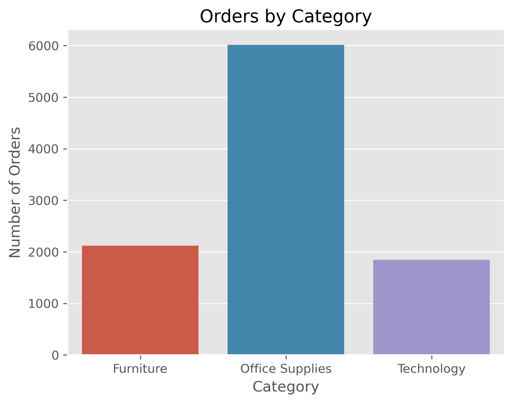
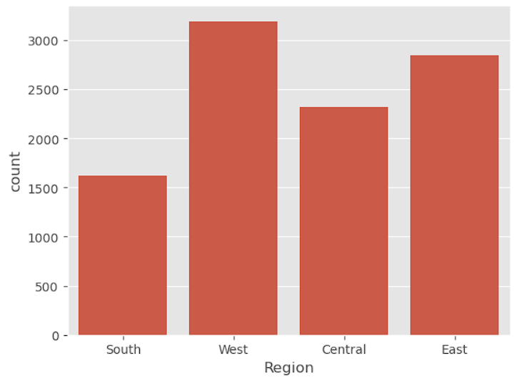
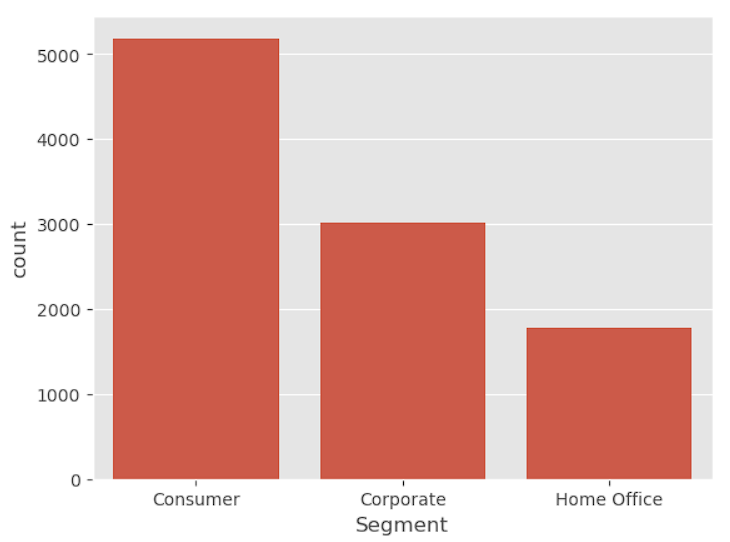
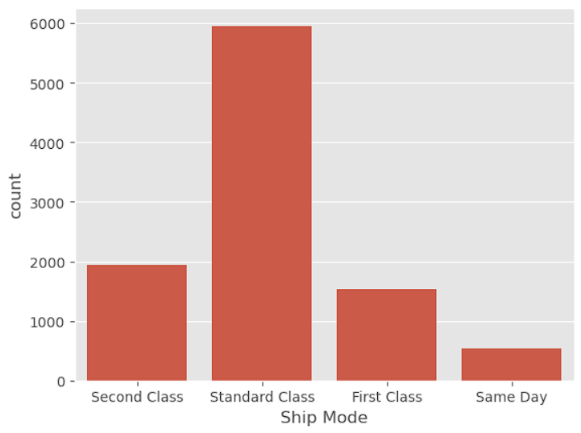
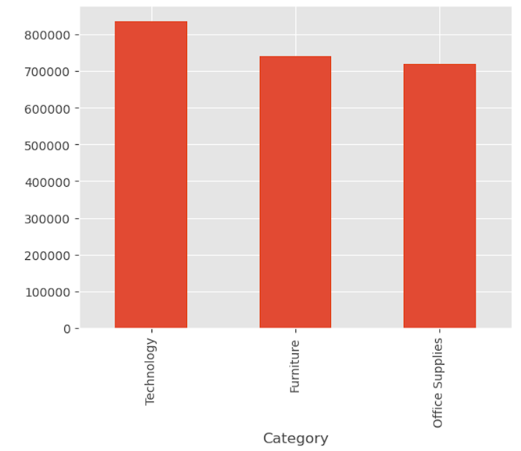
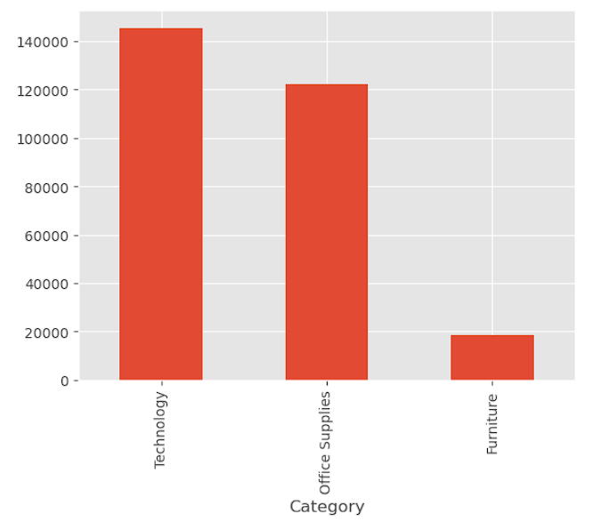
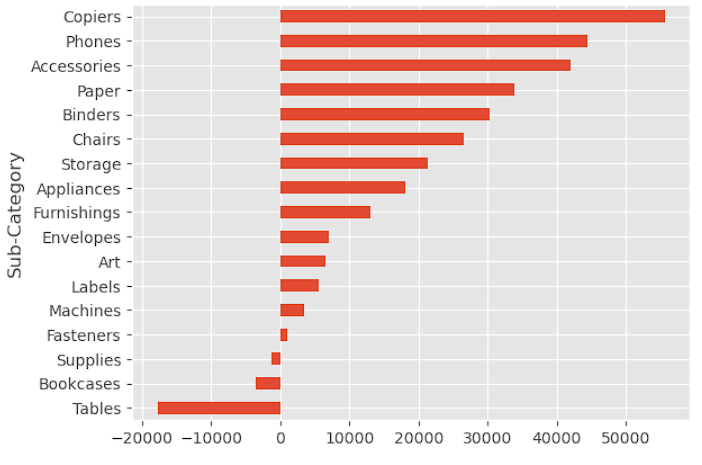
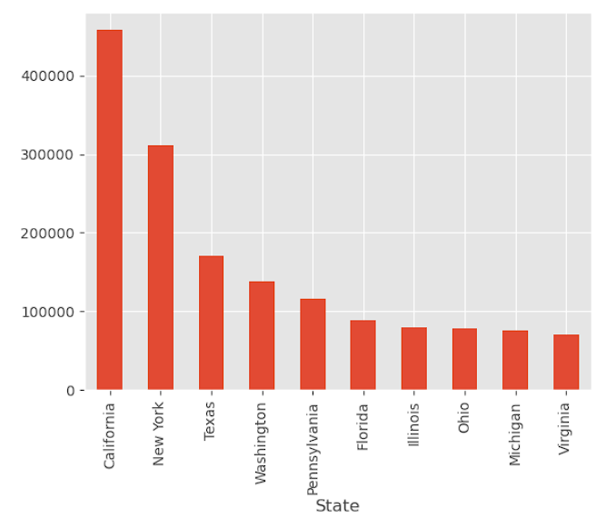
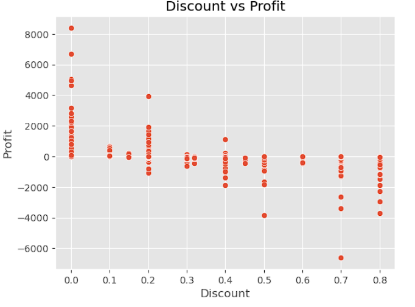
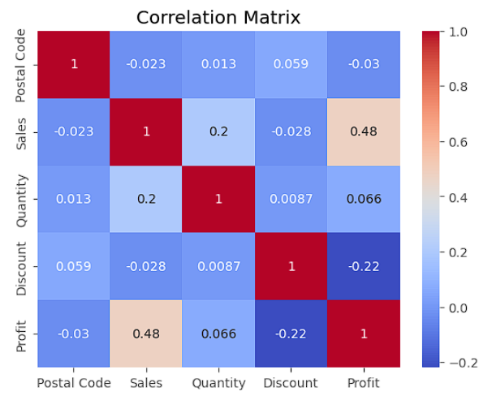

# 📊 Retail Sales Analysis using Python

## 📌 Project Overview

This project performs an end-to-end **Exploratory Data Analysis (EDA)** on the Superstore retail dataset using **Python**. The objective is to analyze sales performance, customer behavior, profitability, and regional trends to generate actionable business insights and support data-driven decision-making.

---

## 🎯 Business Problem

A retail company wants to analyze its historical sales data to answer the following business questions:

- Which product categories generate the highest sales and profits?
- Which regions and customer segments contribute the most orders?
- Which products are causing losses?
- How do discounts impact profitability?
- What business strategies can improve overall performance?

---

## 🎯 Project Objectives

- Perform data inspection and cleaning
- Analyze sales performance across different categories
- Understand customer purchasing behavior
- Identify profitable and loss-making products
- Analyze regional and state-wise sales
- Study the impact of discounts on profits
- Generate business insights and recommendations

---

## 🛠️ Tools & Technologies Used

- Python
- Pandas
- NumPy
- Matplotlib
- Seaborn
- PostgreSQL
- Jupyter Notebook

---

## 📂 Dataset Information

**Dataset:** Sample Superstore

**Dataset Size**

- 📄 Records: **9,977**
- 📊 Features: **13**

The dataset includes information related to:

- Orders
- Customers
- Products
- Categories
- Sales
- Profit
- Discounts
- Shipping
- States
- Regions

---

## 📋 Project Workflow

1. Business Understanding
2. Data Loading
3. Data Inspection
4. Data Cleaning
5. Exploratory Data Analysis (EDA)
6. Data Visualization
7. Business Insights
8. Business Recommendations
9. Export Data to PostgreSQL

---

## 📊 Visualizations

### Orders by Category



---

### Orders by Region



---

### Orders by Customer Segment



---

### Orders by Ship Mode



---

### Sales by Category



---

### Profit by Category



---

### Profit/Loss by Sub-Category



---

### Top 10 States by Sales



---

### Discount vs Profit



---

### Correlation Heatmap



---

## 📈 Key Business Insights

- Office Supplies received the highest number of customer orders.
- The West and East regions recorded the highest order volume.
- The Consumer segment contributed the largest share of total orders.
- Standard Class was the most preferred shipping method.
- Technology generated the highest overall sales and profits.
- The Tables sub-category contributed the highest overall losses.
- Higher discounts generally resulted in lower profitability.

---

## 💼 Business Recommendations

- Maintain sufficient inventory for high-demand product categories.
- Continue strengthening operations in the West and East regions while improving customer engagement in lower-performing regions.
- Develop targeted marketing campaigns for the Corporate and Home Office customer segments.
- Review pricing and discount strategies to reduce profit loss.
- Re-evaluate the pricing and procurement strategy for the Tables sub-category.
- Monitor discount policies regularly to maximize profitability without reducing sales.

---

## 📚 Skills Demonstrated

- Data Cleaning
- Exploratory Data Analysis (EDA)
- Data Visualization
- Business Insight Generation
- Business Recommendation
- Statistical Analysis
- Python Programming
- SQL Data Export
- Problem Solving

---

## 📁 Repository Structure

```text
Retail-Sales-Analysis-Python/
│
├── README.md
├── requirements.txt
├── SampleSuperstore.csv
│
├── notebook/
│   └── Retail_Sales_Analysis.ipynb
│
└── Images/
    ├── orders_by_category.png
    ├── orders_by_region.png
    ├── orders_by_segment.png
    ├── orders_by_ship_mode.png
    ├── sales_by_category.png
    ├── profit_by_category.png
    ├── profit_loss_by_subcategory.png
    ├── top10_states_by_sales.png
    ├── discount_vs_profit.png
    └── correlation_heatmap.png
```

---

## ▶️ How to Run the Project

### Clone the repository

```bash
git clone https://github.com/ch-praveen-kumar/Retail-Sales-Analysis-Python.git
```

### Install the required libraries

```bash
pip install -r requirements.txt
```

### Launch Jupyter Notebook

```bash
jupyter notebook
```

Open **Retail_Sales_Analysis.ipynb** and run all cells.

---

## 📌 Conclusion

This project demonstrates an end-to-end retail sales analysis using Python. Through data cleaning, exploratory data analysis, visualization, and business interpretation, the project identifies key sales trends, customer behavior, profitability drivers, and opportunities for business improvement. The generated insights can support data-driven decision-making and strategic planning.

---

## 👨‍💻 Author

**Chintha Praveen Kumar**

- GitHub: https://github.com/ch-praveen-kumar
- LinkedIn: https://www.linkedin.com/in/ch-praveenkumar/

---

⭐ If you found this project useful, consider giving it a ⭐ on GitHub.
